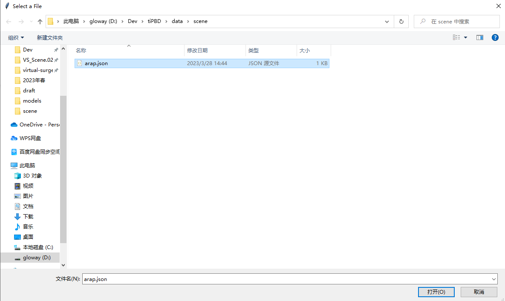
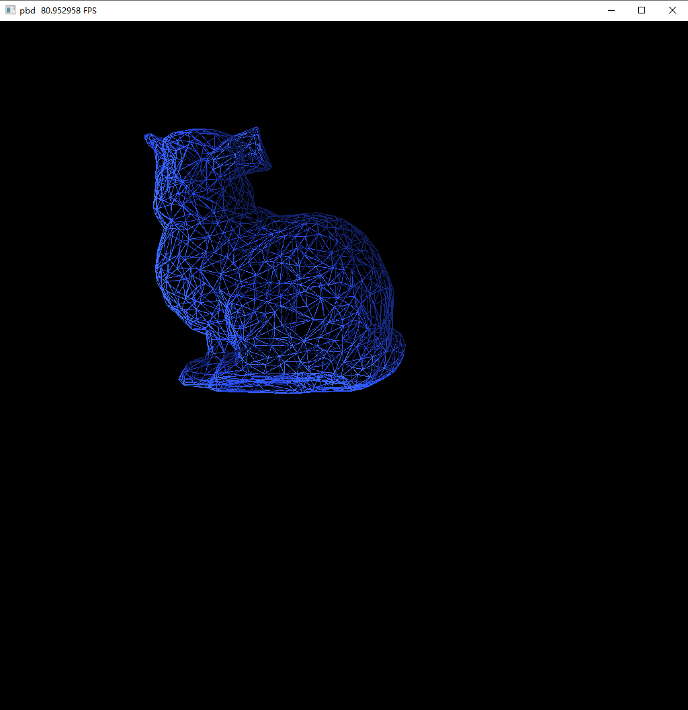

# 简介

这是taichi pbd库。

需要taichi>= 1.4.1和meshtaichi

使用方法：

在data/scene中添加场景文件，在model中添加几何文件（现在仅支持tetgen格式），然后从根目录运行`main.py`。

```python
python main.py
```






## 文件结构

- main # 主程序入口
- data
  - scene # 场景文件
  - model # 模型文件
  - config # 命令行参数配置文件，使用这些参数相当于命令行参数
- engine # 引擎
  - solver # 求解器, 用于实例化具体的pbd solver，以及ggui
  - fem # 基于有限元的PBD。
    - arap: # as rigid as possible 本构模型
    - neohooken: # neo-hooken模型
  - fluid # 流体
    - pbf # position based fluid
  - visulize # taichi自带的GGUI可视化
  - mesh_io # 读写网格文件 以及相关工具，主要使用trimesh
  - sdf # 生成有符号距离场
- ui # 用户界面
  - dearpygui(optional) # 基于dearpygui的gui, 独立进程运行
  - webui(optional) # 基于gradio的gui, 独立进程运行
- resutl # 结果
- args.ini # 默认的命令行参数, 更改此文件相当于给定命令行参数


## 自定义程序

为了遵循高内聚低耦合的原则，本程序将遵循以下约定：
1. 新增的功能不应该影响旧的功能
2. 程序运行的必须参数要尽量少。获取参数要尽量延后。
3. 对新增代码，可以复用原有代码，但也可以选择不用。不用的时候旧代码不应该对新代码有过多限制。


因此，所有的功能模块尽量以搭积木的方式使用。例如要实现一个新的软体模拟NewSoftBody，本程序提供的积木为：
1. GGUI可视化。需要更改solver_main.py。在solver_main函数开头的if语句中增加import new_softbody, 然后pbd_solver = NewSoftBody()。NewSoftBody实例至少要实现substep方法，并且至少要有pos_show属性，代表粒子的位置。如果要显示三角面，还可以定义indices_show属性，代表三角面的顶点索引。

2. 从json解析参数。json文件必须要有common和materials两个顶层的key。分别代表通用的参数和某个物体特有的参数。其中materials是个list。 使用meta.get_common("key名")和meta.get_materials("key名")获取参数。json文件请放在data/scene目录下。

3. 网格读入。参见engine/mesh_io中的网格解析器。支持tetgen/obj/ply等格式。

## 其他说明
### 跳过json选择器
如果不想要json选择器，而是直接给定json路径来指定参数，可以在args.ini中指定scene_file = "/data/scene/arap_bunny.json"。或者从命令行给定--scene_file。当scene_file不为空时，会直接读取该文件，而不会弹出选择器。

另外，还可以搭配no_gui（在json中指定）

### 万能的meta

在本程序中meta是个万能的instance。所有的参数都作为它的属性。包括物理参数（例如杨氏模量，时间步长等）和模拟的超参数（比如当前的帧号）。meta可以作为沟通不同模块的中转站。值得小心的是属性的先后顺序，因为后添加的同名属性可能会覆盖前面的。solver_main函数是第一次使用meta的地方。


## Roadmap

- volumetric(softbody)
  - [x]  arap
  - [x] mass_spring_volumetric
  - [x] neohooken
  - [ ] strain_based_dynamics
  - [ ] xpbd_bar
- fluid
  - [x] pbf2d
  - [x] pbf3d
- shape matching
  - [x] rigidbody
- sdf collider
  - [ ] implicit(box/cylinder/sphere/torus etc.)
  - [x] explicit sdf(from mesh)
  - [ ] dynamic sdf
- other
  - [x] particle selector
  - [x] mesh reading(obj/tetgen/ply)
  - [x] scene file(json) parser
  - [x] command line parser
  - [ ] logger
