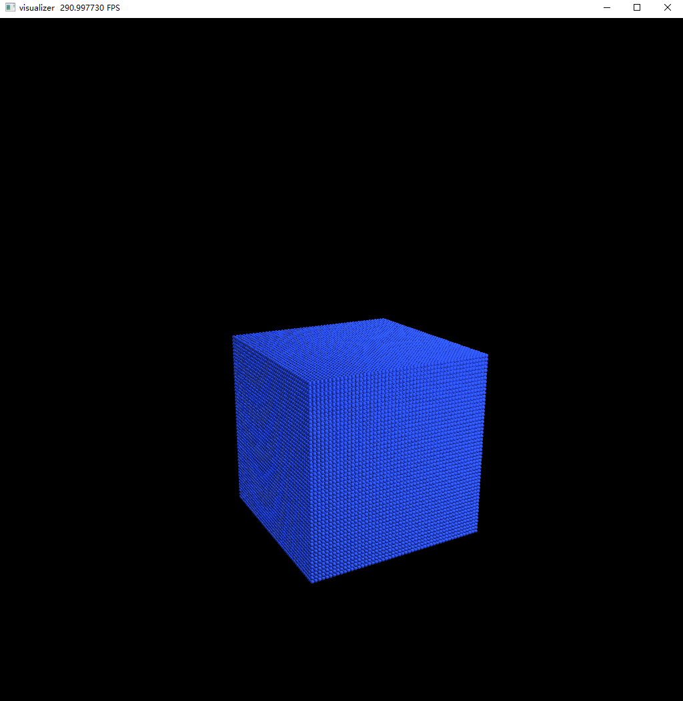

## 将网格转换为粒子点云

对应houdini的volume from points节点

导入一个obj网格文件，然后将其转换为粒子点云

```python
pts_np = point_cloud_from_mesh()
import taichi as ti
ti.init()
pts = ti.Vector.field(3, dtype=ti.f32, shape=pts_np.shape[0])
pts.from_numpy(pts_np)
from visualize import visualize
visualize(pts)
```

结果如图

